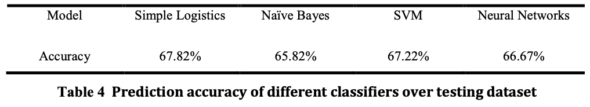
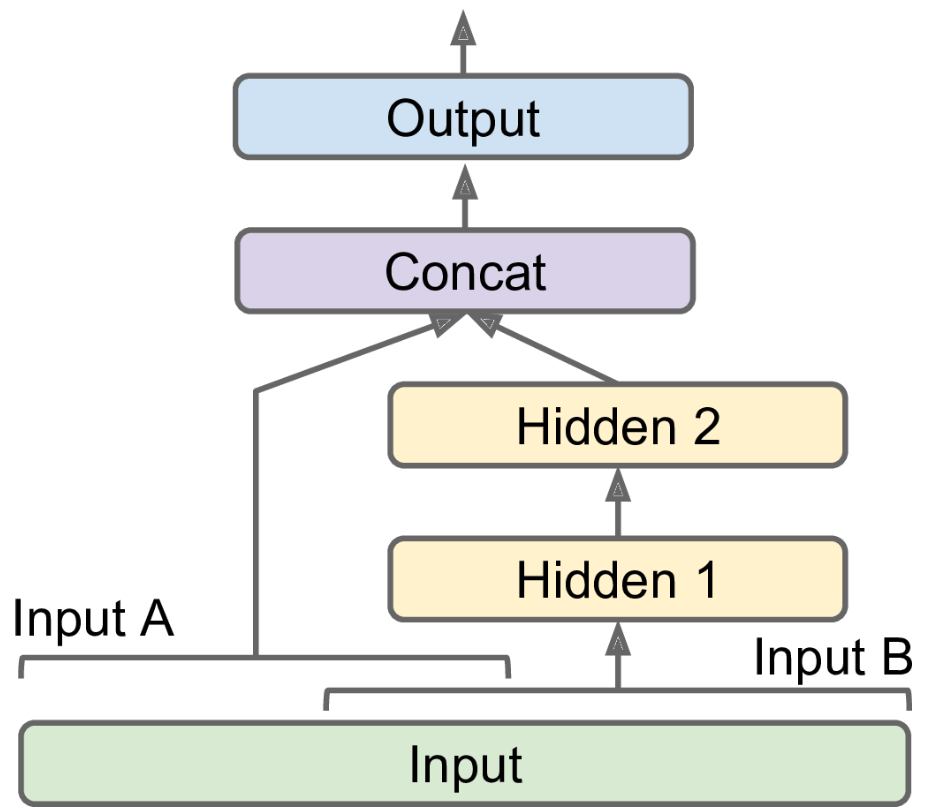

# Using Machine Learning to Predict Wins of Brawl Stars Games
## Intro
Brawl Stars is a mobile video game developed by Supercell (same developers of Clash Royale and Clash of Clans). I aimed to create a machine learning model that could predict the outcome of games given a set of features associated with the players in the game. I was particularly interested in the idea of finding a best team composition. I take a short detour on what appears to be a similar problem: best of rock paper scissors game. Overall, I gained experience collecting my own data using an asynchronous client, pandas for data cleaning, and training various machine learning algorithms using Scikit-learn and TensorFlow-Keras.

## Data Collection
#### `get_data.ipynb`
In 'client.py', I created an asynchronous client to collect game data from the Brawl Stars official API (developer.brawlstars.com). The Brawl Stars API only has a list of recently played matches by player. Starting from the top 200 players as a seed, I recursively added players to pool of player ids from which I subsequently fetched all of their recently played games. All the data was saved into a sqlite3 database which has approximately 4 million games and information on 350 thousand players.

## Data Cleaning
#### `clean_data.ipynb`
Within Brawl Stars, there are numerous game modes each with different rules. In addition, there are different maps for each mode. I did not expect models to generalize between the game modes or between maps, so I filtered the data for the most popular game mode and map in my dataset, which was Brawl Ball played on Sunny Soccer. Subsequent filtering was done to only include high level games which were determined based on match making rating (MMR). After filtering, there were 30 thousand unique games. Higher level games were chosen for ease of predictability (there is a higher chance of mismatch in MMR) and for results that apply to high level gameplay. I planned to try to answer questions like: how much skill is involved, what are the best characters in the game, etc. I would prefer to use high level game play to answer these kinds of questions.

### Features
Brawl ball is a 3 vs. 3 game mode where teams aim to push a ball past a goal line. Each record represented a unique game in the data frame. Each game had the features 'team{team_num}_player{player_num}_{feature_type}' where 'team_num", 'player_num', and 'feature_type' were taken from '[1,2]', '[1,2,3]', and '["brawler", "trophies", "power", "highestTotalTrophies", "totalTrophies", "exp", "highestPowerPlay", "3vs3Victories", "soloVictories", "duoVictories", "highestBrawlerTrophies"]' respectively. There was a column "result" which was 1 if team 1 won the game and 0 if team 1 lost the game. The "result" column is the column that the model tries to predict. In the section about manual predictions, I go about explaining some of the features I think are worth mentioning.

## Developing a baseline
### Manual Predictions
As the self proclaimed human expert, I randomly took 20 games and correctly predicted 80% of the outcomes (team 1 win or loss). My general strategy was to look at features that included trophies then to look at the brawler feature. Without getting into the details of why there are so many different trophy features, 'trophies' is a numerical feature determined by a player's previous wins and losses. People earn trophies after winning a game and lose trophies after losses. To make the game fair, the matchmaking system uses trophies as a player's MMR. Theoretically, it should be easy to predict games based off a player's trophies; however, due to the matchmaking system, trophies are generally even on both teams.

Due to the matchmaking system placing trophies so close, I used brawler team composition as large predictor. The categorical variable, "brawler", determines the one of 32 brawlers in the game used by a particular player during a game. What is interesting is that some brawlers are designed to counter (meaning having an edge over) other brawlers. The heart of the problem is that some brawlers counter other brawlers, and there is no "best" brawler in the game. In a way, it is like asking in Rock Paper Scissors whether rock, paper, or scissors is the strongest choice. For example, brawler A might counter brawler B, brawler B counters brawler C, and brawler C counters brawler A. Another interesting relationship is synergies which happen when a team composition complements itself. For example, the brawler "Poco" works well with tanks. In top competitive play "Poco" with tanks is a formidable composition; however, the team composition with "Poco" and mid to long range brawlers struggles. Learning the subtleties of team composition interaction is a very difficult task.

My manual prediction was 80%. I have played the game since its release and thus have logged upwards of 14,000 games. I am only feeding my algorithm 30,000 games and given the fact that humans learn significantly more quickly than computers I expect 80% to be a high upper bound.

### Other Sources
#### League of Legends
League of Legends is a popular 5 vs 5 video game which displays some of the same ideas of “counters” as shown in the manual predictions section. The article achieved around a 60% accuracy. League of Legends is vastly more complex and the article only uses only 1700 games.

https://hackernoon.com/league-of-legends-predicting-wins-in-champion-select-with-machine-learning-6496523a7ea7

#### Sports
Sport games are vastly more complex than simple video game prediction. Doing a quick search, I found that the best models have about a 60-70% accuracy. Surprisingly, the paper found that Logistic Regression performed best on their dataset (as does logistic regression in my case). 

https://arrow.tudublin.ie/cgi/viewcontent.cgi?article=1040&context=scschcomdis pg. 73

### Base models
#### `project.ipynb`
When the categorical variables were dropped (no consideration of team composition), Logistic regression, support vector machine with rbf kernel, and ensemble model worked best with 65-66% accuracy. When the categorical variables were included (one hot encoded), the same three models performed equally well with around 67-68% accuracy. Including the categorical variables certainly increased the accuracy; however, not as much as I had anticipated. There is certainly room to improve in developing a model that can better understand the categorical variables. The fact that logistic regression is achieving similar to if not higher accuracy than the other models means that the models can only understand linear relationships (the model does not yet understand the idea of counter cycles or high skill characters).

## Similar Problems: Best of Rock Paper Scissors 
#### `rock_paper_scissors.ipynb`
As mentioned earlier, I anticipated the brawler match ups to be highly predictive of the outcome of the game. The wheel of brawlers countering brawlers is similar to rock paper scissors in that there is no definitive best choice to make between rock, paper, and scissor. By trying to solve this problem, I hope to get an understanding of which model has a high chance of working properly on my problem. The exact details can be found in `rock_paper_scissors.ipynb`.

As a summary of the results, I found that support vector machines (SVMs) worked well; however, they were limited by their computational complexity. It would simply take too long to train some the SVMs on anything more than 100,000 instances of 96 features. Neural nets seemed to be the optimal model for the task because they were not limited by the size of the data set.

## Training my final model
#### `project.ipynb`
With the baseline measurements made, the goal was to make predictions greater than 68%. I artificially enlarge the number of instances by 72 giving me more than 1.5 million training instances with over 250 features. SVMs took too long to run to train on this dataset; therefore, I switched to a neural net. I tried many neural nets with various numbers of hidden layers and nodes per layer.

In summary, I found that with 1.5 million training instances, neural nets tended to overfit the model within the first 5 epochs no matter what architecture I chose (including just having one layer of inputs and one layer of outputs -> this is just another linear model which has already been proven to do well).

#### Summary of results
| Model | Validation Accuracy |
| --- | --- |
| Best Neural Net | 68.6% |
| Logistic Regression | 68.7% |
| SVM (without expanded dataset) | 67.6% |

#### Final Model
If I were to deploy a model, I would choose my best neural net. On the test set (which was only used once), the model had an accuracy of 68.1%.

## Drawing Conclusions
According to my tests, the categorical variables involving team composition only increases the accuracy of my models by at most 5%. Considering that logistic regression is able to detect this 5% increase, I suspect that my models are essentially determining overall “good characters” or characters that are “meta” which can just mean pre-determined ways of playing that have been considered best practices. By examining the weights of the coefficients of the logistic regression model, the model seems to consider trophy features highly which is understandable considering this is a player’s MMR.

This suggests that slight differences in MMR are the biggest predictor of game outcomes. Thus, team composition is only “essential” information if MMR is too close. In the future I might filter the data set to include only games where there is statistical difference in MMRs between the two teams. I would be interested how many games would carry this property. If there are only a few games, then it can be reasonable to assume that there was not enough data to model the effect of team composition on outcome. From my best of rock paper scissors simulation, it takes upwards of 2 million samples depending on the noise of the data given the vast number of the categorical variables and their combinations.

### Future Directions
Overall there is still a statistically significant gap between my manual predictions and the predictions made by my models; therefore, there is certainly room for improvement. One such improvement might be to train a neural net as depicted in the figure below. A neural net could be trained separately based off brawler compositions on data where MMR is statistically different between the teams. Then this neural net would replace Hidden 1 and Hidden 2 as depicted in the figure which is connected to the team composition features labeled Input B. Input A would be the trophy information. This kind of architecture may work better because the data used to train the neural net for brawler compositions will not be “confused” by data that has no association with brawler compositions (a.k.a. data that is determined only from MMR).

